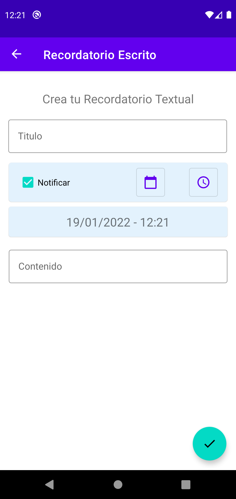

# Tutorial

---
## Agregar Recordatorios

### Recordatorio en General
1. Primero debe utilizar el boton flotante para desplegar las diferentes opciones
 de recordatorios.

2. Debe seleccionar el tipo de recordatorio que mas se ajuste a su necesidad.
 
3. Todos los recordatorios tienen una logica parecida, debes asignarle un titulo (que sea significativo) si decea ser notificado debera seleccionar la checkbox(activa por defecto) luego seleccionar una fecha y hora para ser notificado si esto.

4. Una ves termindo debera persionar el boton flotante con la tilde, si alguno de los campos no estan completos se le informara con una ventana de error o coloreando rojo el campo necesario.

5. Una ves terminado podra ver su recordatorio en la lista, en este caso vemos el texto, solo se mostraran 6 lineas del mismo en caso de querer ver mas puede presionarlo para inspeccionar.

---
### Audios