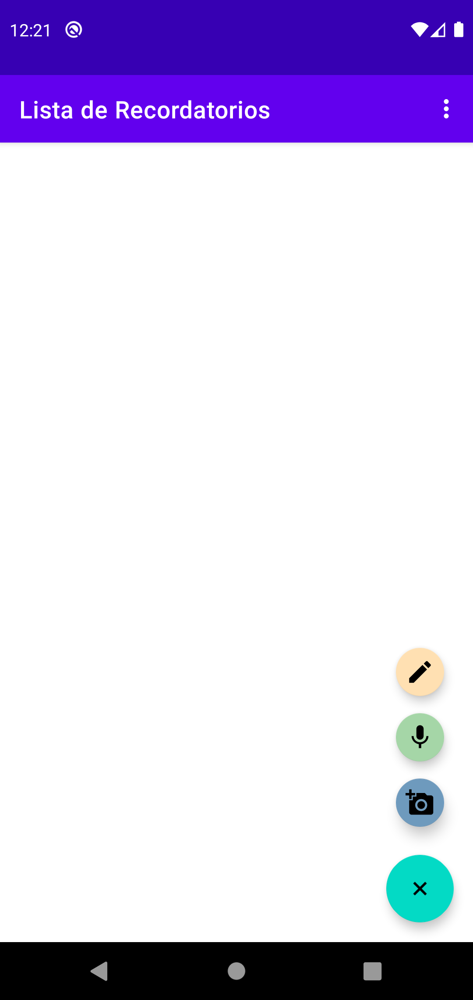
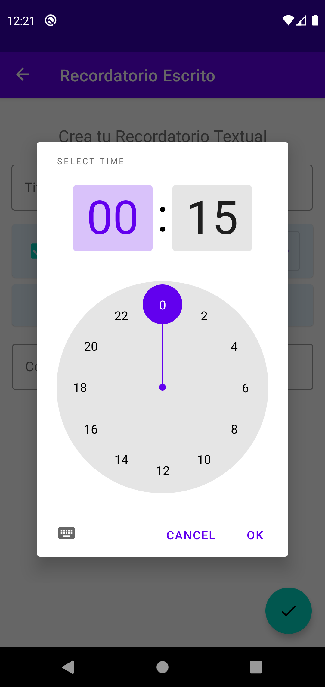
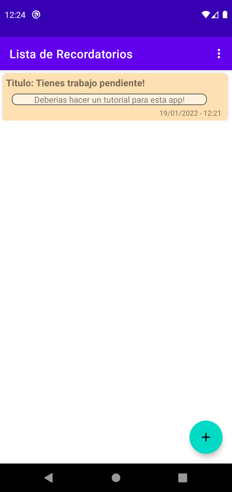

# Tutorial

---

## Agregar Recordatorios

### Recordatorio en General

1. Primero debe utilizar el botón flotante para desplegar las diferentes opciones de recordatorios.

2. Debe seleccionar el tipo de recordatorio que más se ajuste a su necesidad.

3. Todos los recordatorios tienen una lógica parecida, debes asignarle un titulo (que sea significativo) si desea ser notificado deberá seleccionar la checkbox(activa por defecto) luego seleccionar una fecha y hora para ser notificado si esto.

4. Una este terminado deberá presionar el botón flotante con la tilde, si alguno de los campos no están completos se le informara con una ventana de error o coloreando rojo el campo necesario.

5. Una ves terminado podra ver su recordatorio en la lista, en este caso vemos el texto, solo se mostraran 6 lineas del mismo en caso de querer ver más puede presionarlo para inspeccionar.

---

### Fotos

1. Este es el apartado más simple, debes tomar una foto definir un titulo y su hora en caso de ser necesario.

---

### Audios

1. Al seleccionar la opción de los audios debemos tener en cuenta que debemos tener los permisos adecuados para ello.El botón de grabar funciona muy similar a otras aplicaciones que brindan esta funcionalidad, se mantiene pulsado para grabar, se desliza para descartar. Si termino de grabar y aun así no estas conforme con el audio puede sobreescribir al presionar denuedo el botón de grabar.

2. Una vez grabado puede reproducirlo y ver un espectrograma muy rudimentario. Y enviar para recordar el audio.

3. Una vez enviado, podra visualizar el audio y reproducirlo. Ten en cuenta que si quieres reproducir otro audio este se pausara y volverá al minuto 00:00.

